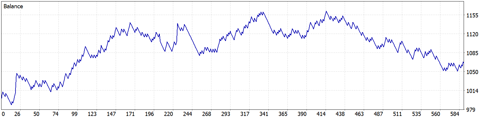
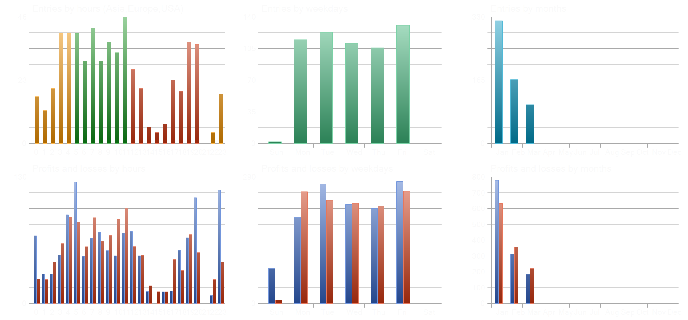
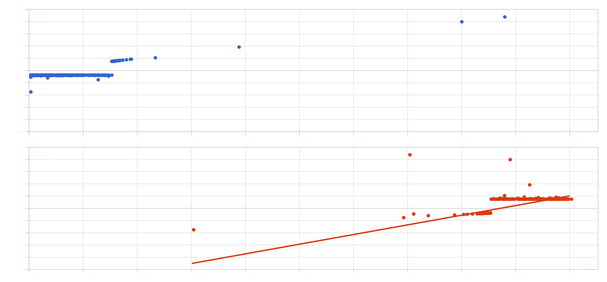
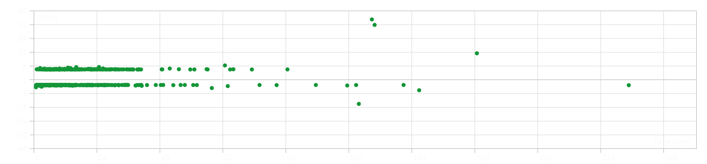

# EA-059 — Bollinger Squeeze Backtest

## Backtest Overview

This directory contains the MetaTrader 5 Strategy Tester results for **EA-059_Bollinger_Squeeze**. The test evaluates the Bollinger Squeeze breakout strategy on XAUUSD using M1 data and 100% real ticks.

## Test Environment

Expert Advisor: EA-059_Bollinger_Squeeze
Symbol: XAUUSD.PRO
Timeframe: M1
Test Period: 2026-01-02 → 2026-04-01
Broker / Server: ACCMIntl-Real
MT5 Build: 6182
Currency: USD
Initial Deposit: $1,000
Leverage: 1:500
History Quality: 100% real ticks
Bars: 86,539
Ticks: 40,346,891

## Parameters Used

Lot Size: 0.01
Stop Loss: 300 points
Take Profit: 600 points
Magic Number: 123456
Slippage: 10 points
Bollinger Period: 20
Bollinger Deviation: 2.0
Squeeze Width: 500 points
Maximum Spread: 30 points
Break Even: Disabled
Break Even Trigger: 150 points
Break Even Lock: 0 points
Trailing Stop: Disabled
Trailing Start: 200 points
Trailing Distance: 150 points

Important: this backtest uses `InpSqueezeWidthPoints=500`. Break Even and Trailing Stop were disabled during this test.

## Main Results

Initial Deposit: $1,000.00
Total Net Profit: **$64.47**
Gross Profit: $1,276.47
Gross Loss: -$1,212.00
Profit Factor: **1.05**
Expected Payoff: $0.11
Recovery Factor: 0.55
Sharpe Ratio: 3.93
Total Trades: **588**
Total Deals: 1,176
Net Return: **+6.447%**

## Drawdown

Balance Drawdown Absolute: $12.02
Balance Drawdown Maximal: $111.83 (9.62%)
Balance Drawdown Relative: 9.62% ($111.83)
Equity Drawdown Absolute: $12.25
Equity Drawdown Maximal: $116.23 (9.97%)
Equity Drawdown Relative: **9.97% ($116.23)**

The maximum reported equity drawdown remained below 10% during this test.

## Trade Statistics

Total Trades: 588
Winning Trades: 199 (33.84%)
Losing Trades: 389 (66.16%)
Short Trades: 303
Short Win Rate: 30.69%
Long Trades: 285
Long Win Rate: 37.19%
Largest Profit Trade: $34.29
Largest Loss Trade: -$13.98
Average Profit Trade: $6.41
Average Loss Trade: -$3.12

The average winning trade was approximately 2.05 times the magnitude of the average losing trade.

## Consecutive Results

Maximum Consecutive Wins: 5
Profit During Max Win Sequence: $55.28
Maximum Consecutive Losses: 19
Loss During Max Loss Sequence: -$57.88
Average Consecutive Wins: 1
Average Consecutive Losses: 3

The test recorded a maximum sequence of **19 consecutive losing trades**.

## Position Holding Time

Minimum Holding Time: 00:00:01
Maximum Holding Time: 03:45:55
Average Holding Time: **00:15:36**

## MFE / MAE Statistics

Correlation Profit vs MFE: 0.86
Correlation Profit vs MAE: 0.70
Correlation MFE vs MAE: 0.4666

## Balance Curve

The balance curve shows an overall profitable test, but performance is not monotonic. The account rose substantially during the earlier and middle portions of the test and subsequently experienced a prolonged decline before finishing above the initial balance.

Final Balance: **$1,064.47**

## Entry Distribution

The Strategy Tester statistics show that trades occurred across multiple trading hours and weekdays.

## MFE / MAE Distribution

This chart records the relationship between trade profit and Maximum Favorable Excursion / Maximum Adverse Excursion.

## Holding-Time Distribution

The holding-time chart shows that most trades are concentrated in shorter holding periods, with a smaller number of positions remaining open substantially longer.

## Backtest Assessment

Positive observations: positive net result of **+$64.47**, return of **+6.447%**, maximum equity drawdown of **9.97%**, Profit Factor above 1 at **1.05**, 588 total trades, 100% real tick history quality, and an average winning trade approximately 2.05 times the average losing trade.

Risks and weaknesses: Profit Factor of **1.05** leaves a small profitability margin, win rate is only **33.84%**, maximum losing streak reached **19 trades**, Recovery Factor is **0.55**, the balance curve gives back a substantial portion of earlier gains near the end of the test, and the current result covers only one symbol, one timeframe, one broker environment, and approximately three months of historical data.

## Current Conclusion

**Status: PROFITABLE BACKTEST — NOT YET ROBUSTNESS-VALIDATED**

Under this specific MT5 configuration, EA-059 finished profitable with an initial balance of **$1,000.00**, net profit of **+$64.47**, final balance of **$1,064.47**, return of **+6.447%**, Profit Factor of **1.05**, maximum equity drawdown of **9.97%**, and 588 total trades.

The result demonstrates that the strategy produced a positive outcome under the tested conditions. However, this backtest alone should not be interpreted as proof of production readiness or long-term robustness.

## Evidence Files

README.md
ReportTester-952747.html
ReportTester-952747.png
ReportTester-952747-hst.png
ReportTester-952747-mfemae.png
ReportTester-952747-holding.png

`ReportTester-952747.html` is the original MetaTrader 5 Strategy Tester report and primary source of numerical results.
`ReportTester-952747.png` is the balance curve.
`ReportTester-952747-hst.png` contains entry and profit/loss distribution statistics.
`ReportTester-952747-mfemae.png` contains MFE/MAE analysis.
`ReportTester-952747-holding.png` contains position holding-time distribution.

The original HTML report should be preserved unchanged as the primary backtest evidence.

## Reproducibility

To reproduce this specific test, use the same EA version, XAUUSD.PRO symbol, M1 timeframe, 2026-01-02 → 2026-04-01 test period, $1,000 initial deposit, 1:500 leverage, 0.01 fixed lot, 300-point Stop Loss, 600-point Take Profit, Magic Number 123456, Slippage 10, Bollinger Period 20, Bollinger Deviation 2.0, Squeeze Width 500 points, Maximum Spread 30 points, Break Even disabled, Trailing Stop disabled, and 100% real tick historical data.

Broker symbol specifications and historical tick data may affect reproducibility across different MetaTrader 5 environments.

## Disclaimer

This backtest is historical research evidence and is not a guarantee of future performance. XAUUSD is a leveraged and highly volatile instrument. Live results may differ because of spread, slippage, execution latency, liquidity, broker specifications, commissions, swaps, and changing market conditions.
