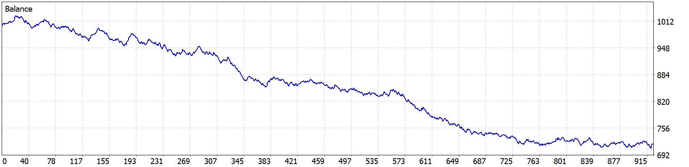
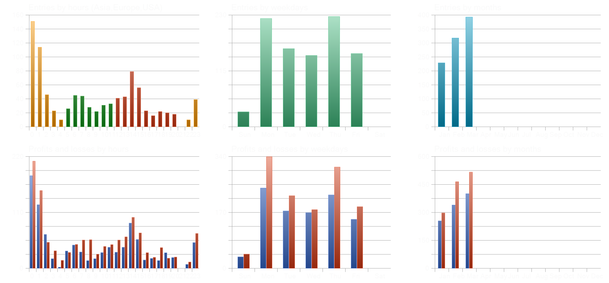
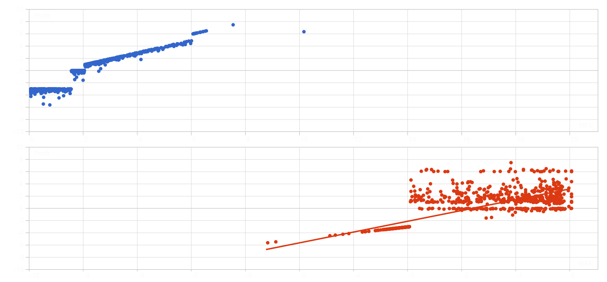
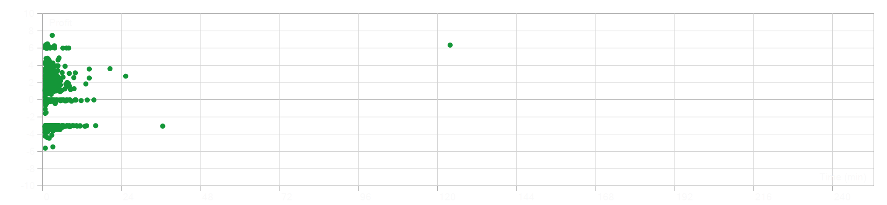

# EA-079 — MT5 Backtest Report

## Test Configuration

| Setting | Value |
|---|---|
| Expert Advisor | EA-079_Daily_Open_Break |
| Symbol | XAUUSD.PRO |
| Timeframe | M1 |
| Test Period | 2026-01-02 to 2026-03-31 |
| Broker | ACCM Intl Limited |
| Account Server | ACCMIntl-Real |
| Account Currency | USD |
| Initial Deposit | $1,000 |
| Leverage | 1:500 |
| Modeling Quality | 100% real ticks |
| Bars | 85,161 |
| Ticks | 39,639,179 |

The test uses the EA parameters documented in the source-code README.

## Performance Results

| Metric | Result |
|---|---:|
| Total Net Profit | -$282.20 |
| Gross Profit | $995.95 |
| Gross Loss | -$1,278.15 |
| Profit Factor | 0.78 |
| Expected Payoff | -$0.30 |
| Recovery Factor | -0.89 |
| Sharpe Ratio | -5.00 |
| Maximum Balance Drawdown | $317.26 (30.95%) |
| Maximum Equity Drawdown | $318.58 (31.05%) |
| Total Trades | 940 |
| Winning Trades | 433 (46.06%) |
| Losing Trades | 507 (53.94%) |
| Average Winning Trade | $2.30 |
| Average Losing Trade | -$2.52 |
| Largest Winning Trade | $7.48 |
| Largest Losing Trade | -$5.62 |

## Trade Distribution

| Direction | Trades | Win Rate |
|---|---:|---:|
| BUY | 479 | 43.63% |
| SELL | 461 | 48.59% |

The SELL trades had a higher historical win rate in this test. This alone does not establish a profitable short-only strategy.

## Position Holding Time

| Metric | Duration |
|---|---|
| Minimum | 2 seconds |
| Average | 1 minute 47 seconds |
| Maximum | 2 hours 3 minutes 1 second |

The average holding time is short, making execution costs and spread behavior important subjects for further investigation.

## Equity Curve

The balance curve shows a sustained decline during the test period, with several periods of temporary recovery.

The strategy finishes below its initial balance and does not demonstrate a positive trading edge in this configuration.

## Trade Distribution Charts

The charts show trading activity by hour, weekday and month, together with profit and loss distributions.

Trading activity is concentrated in the first three months of 2026 because the supplied test covers only that period.

## MFE and MAE Analysis

Reported correlations:
- Profit and MFE: 0.96
- Profit and MAE: 0.76
- MFE and MAE: 0.6539

These statistics describe the supplied historical trades. They do not independently establish which exit settings would improve future performance.

## Holding Time Distribution

Most positions were held for a relatively short period, with a small number of longer-duration trades.

## Test Conclusion

**Result: FAILED**

The tested configuration produced a negative net profit, a profit factor below 1.0 and a maximum equity drawdown exceeding 30%.

Further research is required before considering live deployment.

The report represents one historical test, not proof that all configurations of the underlying strategy are unprofitable.
